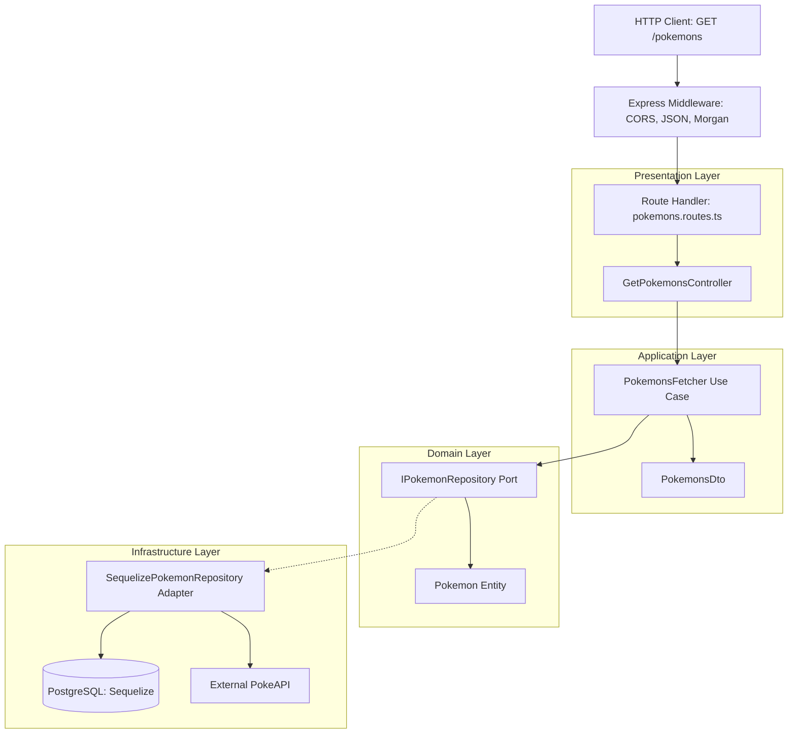
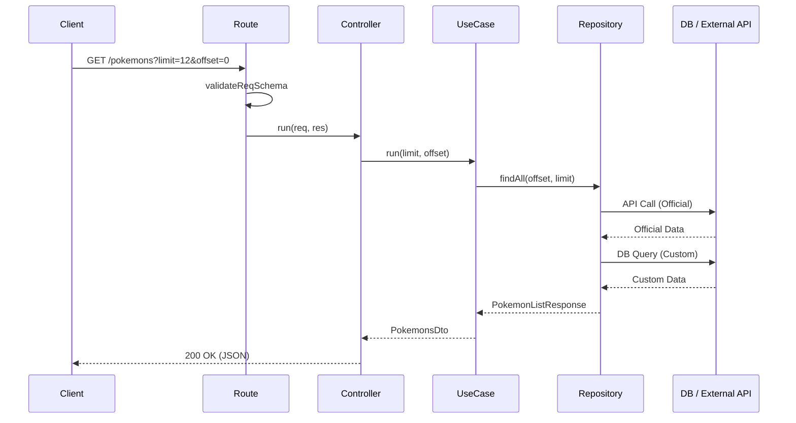
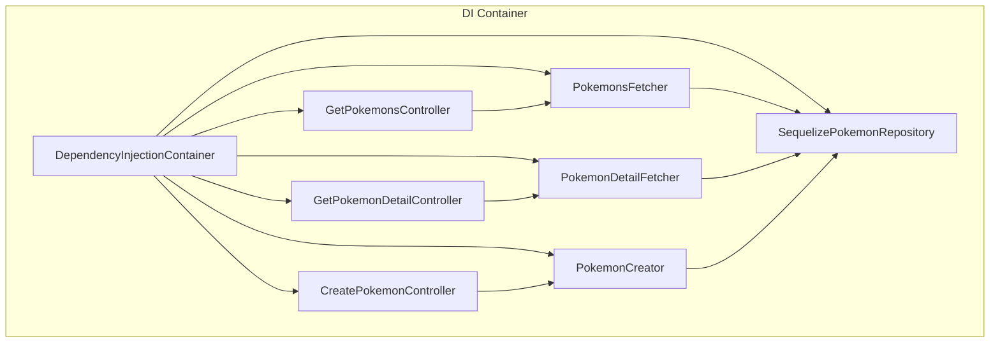
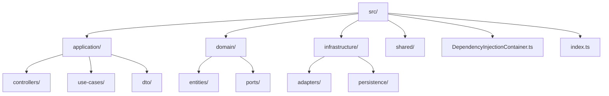

# GET Pokemons Endpoint - Architecture Diagram

## Component Diagram

```mermaid
graph TD
    Client[HTTP Client: GET /pokemons] --> Middleware[Express Middleware: CORS, JSON, Morgan]
    Middleware --> Route[Route Handler: pokemons.routes.ts]
    
    subgraph Presentation Layer
        Route --> Controller[GetPokemonsController]
    end
    
    subgraph Application Layer
        Controller --> UseCase[PokemonsFetcher Use Case]
        UseCase --> DTO[PokemonsDto]
    end
    
    subgraph Domain Layer
        UseCase --> RepositoryInterface[IPokemonRepository Port]
        RepositoryInterface --> Entity[Pokemon Entity]
    end
    
    subgraph Infrastructure Layer
        RepositoryInterface -.-> RepositoryAdapter[SequelizePokemonRepository Adapter]
        RepositoryAdapter --> DB[(PostgreSQL: Sequelize)]
        RepositoryAdapter --> API[External PokeAPI]
    end
```

## Sequence Diagram

```mermaid
sequenceDiagram
    participant Client
    participant Route
    participant Controller
    participant UseCase
    participant Repository
    participant DB_API as DB / External API

    Client->>Route: GET /pokemons?limit=12&offset=0
    Route->>Route: validateReqSchema
    Route->>Controller: run(req, res)
    Controller->>UseCase: run(limit, offset)
    UseCase->>Repository: findAll(offset, limit)
    Repository->>DB_API: API Call (Official)
    DB_API-->>Repository: Official Data
    Repository->>DB_API: DB Query (Custom)
    DB_API-->>Repository: Custom Data
    Repository-->>UseCase: PokemonListResponse
    UseCase-->>Controller: PokemonsDto
    Controller-->>Client: 200 OK (JSON)
```

## Dependency Injection Container

```mermaid
graph TD
    subgraph DI Container
        DI[DependencyInjectionContainer] --> Repo[SequelizePokemonRepository]
        DI --> UseCase1[PokemonsFetcher]
        DI --> UseCase2[PokemonDetailFetcher]
        DI --> UseCase3[PokemonCreator]
        
        UseCase1 --> Repo
        UseCase2 --> Repo
        UseCase3 --> Repo
        
        DI --> Ctrl1[GetPokemonsController]
        DI --> Ctrl2[GetPokemonDetailController]
        DI --> Ctrl3[CreatePokemonController]
        
        Ctrl1 --> UseCase1
        Ctrl2 --> UseCase2
        Ctrl3 --> UseCase3
    end
```

## File Organization

```mermaid
graph TD
    Root[src/]
    Root --> App[application/]
    Root --> Dom[domain/]
    Root --> Inf[infrastructure/]
    Root --> Sha[shared/]
    
    App --> Ctrls[controllers/]
    App --> UseCases[use-cases/]
    App --> DTOs[dto/]
    
    Dom --> Entities[entities/]
    Dom --> Ports[ports/]
    
    Inf --> Adapters[adapters/]
    Inf --> Pers[persistence/]
    
    Root --> DI[DependencyInjectionContainer.ts]
    Root --> Entry[index.ts]
```
