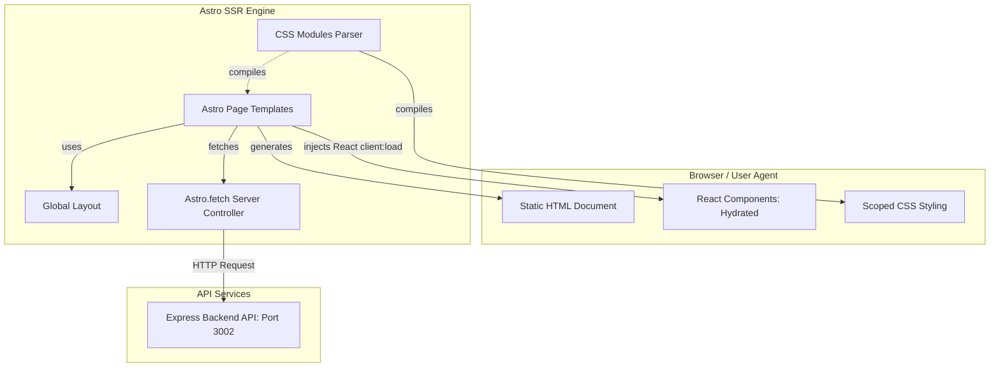
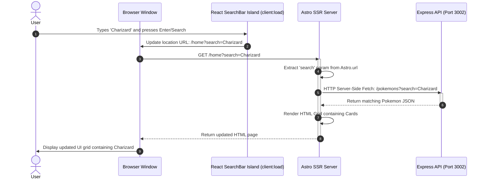
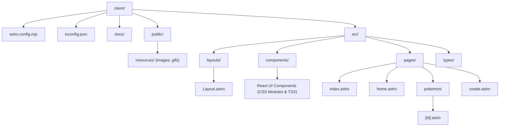

# Client Architecture

This document describes the design, component interactions, data flow, and file layout of the modern Astro SSR client codebase for the PokeApp.

---

## 1. Component Architecture (Islands of Interactivity)

The application uses Astro's **Island Architecture**. The layout, navigation, and detailed views are rendered statically to pure HTML on the server. Interactive features (like searching or complex forms) are hydrated dynamically as client-side React islands.

---

## 2. Dynamic Search Sequence (Server-Side Driven)

State is stored in the browser's URL search parameters rather than in client-side memory stores (like Redux). The diagram below displays how a search query triggers server-side updates:

---

## 3. Project File Organization

The application code files are organized by routing entries and framework purposes:

