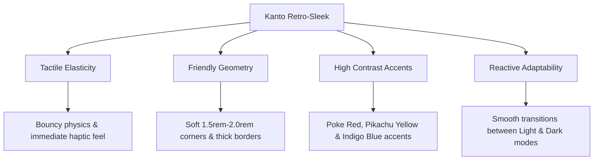
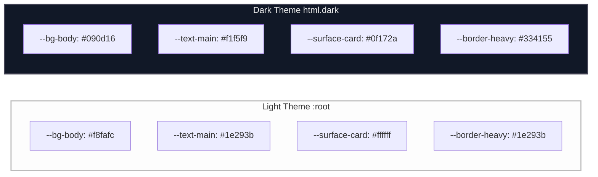
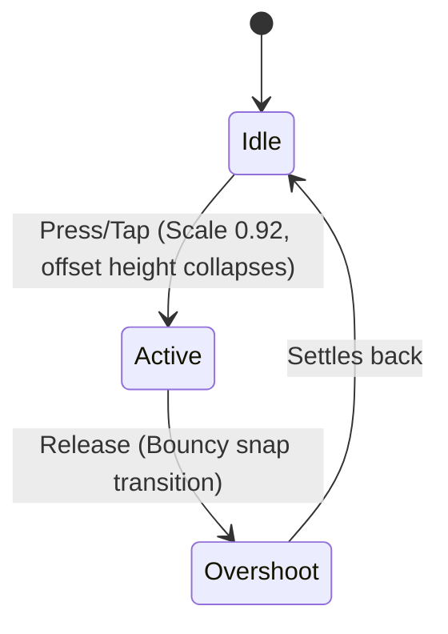

# Kanto Retro-Sleek Design System

**Version:** `1.2.0`  
**Core Aesthetic:** Nostalgic Organic Tactility (Modernized Game Boy & Nintendo Switch Feel)  
**Target Audience:** Pokémon Enthusiasts, Trainer Utilities, Competitive Trackers, and Casual Gaming Platforms

---

## 1. Design Philosophy

The **Kanto Retro-Sleek** design system merges the bold, high-contrast, nostalgic energy of first-generation Pokémon titles with sleek, modern, organic user-interface patterns. 

Our core design pillars are:



### 1.1 Core Design Pillars

*   **Tactile Elasticity (The "Bouncy" Feel):** Interactive elements must feel physically responsive. Clicking or tapping a button should compress the element, giving immediate haptic-like visual feedback.
*   **Friendly Geometry:** Soft, highly rounded corners (using `border-radius: 1.5rem` to `2rem`) combined with thick, heavy borders mimics retro cartridge/console hardware while remaining highly approachable.
*   **High Contrast Brand Markers:** Saturated primary accents (Poke Red, Pikachu Yellow, Indigo Blue) are anchored by clean charcoal grays and highly readable system backdrops.
*   **Reactive Adaptability:** Interfaces must dynamically scale and flip parameters seamlessly between light-filled exploration environments and low-light midnight battle systems.

---

## 2. Design Tokens & CSS Custom Properties

These tokens serve as the unified variable schema to construct all style layers. Insert these properties directly into your global stylesheet (e.g., inside the `:root` selector in [Layout.astro](file:///Users/mstefanutti/workspace/PokeApp/client/src/layouts/Layout.astro#L20-L29)).

### 2.1 CSS Custom Properties (Theme Variables)

```css
:root {
  /* Layout Backdrops */
  --bg-body: #f8fafc;
  --text-main: #1e293b;
  --text-muted: #64748b;
  --text-inverse: #ffffff;
  
  /* Component Surfaces */
  --surface-card: #ffffff;
  --surface-inner: #f1f5f9;
  --border-color: #cbd5e1;
  --border-heavy: #1e293b;
  
  /* Brand Accents */
  --poke-red: #ef4444;
  --poke-red-gradient: linear-gradient(180deg, #ef4444 0%, #dc2626 100%);
  --poke-blue: #3b4cca;
  --poke-yellow: #ffde00;
  
  /* Tactile Physics & Drop Shadows */
  --shadow-box: 6px 6px 0px 0px #1e293b;
  --shadow-toast: 0 10px 25px -5px rgba(0, 0, 0, 0.1), 0 10px 10px -5px rgba(0, 0, 0, 0.04);
  --shadow-btn: 0 4px 6px -1px rgba(0, 0, 0, 0.1);
  --transition-bouncy: all 0.2s cubic-bezier(0.175, 0.885, 0.32, 1.275);
  
  /* Elemental Type Palette (HEX & Background Alpha overlays) */
  --color-fire: #ef4444;
  --color-fire-bg: rgba(239, 68, 68, 0.1);
  --color-water: #3b82f6;
  --color-water-bg: rgba(59, 130, 246, 0.1);
  --color-grass: #10b981;
  --color-grass-bg: rgba(16, 185, 129, 0.1);
  --color-electric: #f59e0b;
  --color-electric-bg: rgba(245, 158, 11, 0.1);
  --color-poison: #a855f7;
  --color-poison-bg: rgba(168, 85, 247, 0.1);
  --color-normal: #78716c;
  --color-normal-bg: rgba(120, 113, 108, 0.1);
  --color-flying: #818cf8;
  --color-flying-bg: rgba(129, 140, 248, 0.1);
  --color-ground: #b45309;
  --color-ground-bg: rgba(180, 83, 9, 0.1);
  --color-psychic: #ec4899;
  --color-psychic-bg: rgba(236, 72, 153, 0.1);
  --color-ice: #22d3ee;
  --color-ice-bg: rgba(34, 211, 238, 0.1);
  --color-fighting: #b91c1c;
  --color-fighting-bg: rgba(185, 28, 28, 0.1);
  --color-bug: #84cc16;
  --color-bug-bg: rgba(132, 204, 22, 0.1);
  --color-rock: #7c2d12;
  --color-rock-bg: rgba(124, 45, 18, 0.1);
  --color-ghost: #6366f1;
  --color-ghost-bg: rgba(99, 102, 241, 0.1);
  --color-dragon: #4f46e5;
  --color-dragon-bg: rgba(79, 70, 229, 0.1);
  --color-steel: #64748b;
  --color-steel-bg: rgba(100, 116, 139, 0.1);
  --color-dark: #1e293b;
  --color-dark-bg: rgba(30, 41, 59, 0.1);
  --color-fairy: #f472b6;
  --color-fairy-bg: rgba(244, 114, 182, 0.1);
}

/* Dark Mode Scheme Activations */
html.dark {
  --bg-body: #090d16;
  --text-main: #f1f5f9;
  --text-muted: #94a3b8;
  
  --surface-card: #0f172a;
  --surface-inner: #070a12;
  --border-color: #1e293b;
  --border-heavy: #334155;
  
  --poke-red-gradient: linear-gradient(180deg, #dc2626 0%, #991b1b 100%);
  --shadow-box: 6px 6px 0px 0px rgba(0, 0, 0, 0.5);
  
  /* Dynamic contrast boost for elemental opacity overlays on dark canvas */
  --color-fire-bg: rgba(239, 68, 68, 0.2);
  --color-water-bg: rgba(59, 130, 246, 0.2);
  --color-grass-bg: rgba(16, 185, 129, 0.2);
  --color-electric-bg: rgba(245, 158, 11, 0.2);
  --color-poison-bg: rgba(168, 85, 247, 0.2);
  --color-normal-bg: rgba(120, 113, 108, 0.2);
  --color-flying-bg: rgba(129, 140, 248, 0.2);
  --color-ground-bg: rgba(180, 83, 9, 0.2);
  --color-psychic-bg: rgba(236, 72, 153, 0.2);
  --color-ice-bg: rgba(34, 211, 238, 0.2);
  --color-fighting-bg: rgba(185, 28, 28, 0.2);
  --color-bug-bg: rgba(132, 204, 22, 0.2);
  --color-rock-bg: rgba(124, 45, 18, 0.2);
  --color-ghost-bg: rgba(99, 102, 241, 0.2);
  --color-dragon-bg: rgba(79, 70, 229, 0.2);
  --color-steel-bg: rgba(100, 116, 139, 0.2);
  --color-dark-bg: rgba(30, 41, 59, 0.2);
  --color-fairy-bg: rgba(244, 114, 182, 0.2);
}
```

### 2.2 Theme Mappings Diagram



---

## 3. Typography: Fredoka Rounded

To project warmth, playfulness, and a clean modern aesthetic, **Fredoka Rounded** is the mandatory font family.

*   **Primary Use Case:** All headers, buttons, body copy, indicators, stats, and navigation interfaces.
*   **Font Import:** Include the following tag inside the global `<head>` section:

```html
<link href="https://fonts.googleapis.com/css2?family=Fredoka:wght@300..700&display=swap" rel="stylesheet">
```

### 3.1 CSS Typography Standards

```css
body {
  font-family: 'Fredoka', sans-serif;
  font-weight: 500; /* Default weight for high readability */
  line-height: 1.5;
}

h1, h2, h3, h4, h5, h6 {
  font-weight: 700;
  line-height: 1.15;
  letter-spacing: -0.01em;
}
```

---

## 4. Elastic Physics & Button Architecture

Every primary button must feature organic, physics-based motion to create an addictive tapping experience on mobile devices and a highly satisfying cursor click on desktop.

### 4.1 Bouncy Animation Coordinates
Using custom cubic-bezier curves ensures that elements over-expand slightly before snapping back into place during hover states or active mouse clicks.

$$\text{Cubic Bezier Mapping: } (0.175, 0.885, 0.32, 1.275)$$



### 4.2 Standard Component Stylesheet

Apply these classes to keep button layouts unified across all development environments:

```css
/* Base Button Structure */
.btn-bouncy {
  font-family: 'Fredoka', sans-serif;
  font-weight: 700;
  display: inline-flex;
  align-items: center;
  justify-content: center;
  gap: 0.5rem;
  border: none;
  cursor: pointer;
  border-radius: 1rem;
  transition: var(--transition-bouncy);
  user-select: none;
  text-decoration: none;
}

.btn-bouncy:active {
  transform: scale(0.92);
}

/* Primary Color Variant */
.btn-primary {
  background-color: var(--poke-red);
  color: var(--text-inverse);
  padding: 0.875rem 1.5rem;
  border-bottom: 4px solid #b91c1c;
  box-shadow: 0 4px 14px rgba(239, 68, 68, 0.2);
}

.btn-primary:active {
  border-bottom-width: 0px;
  margin-top: 4px; /* Matches collapsing 4px border offset */
}

/* Secondary Color Variant */
.btn-secondary {
  background-color: var(--surface-card);
  color: var(--poke-blue);
  border: 2px solid var(--poke-blue);
  border-bottom: 4px solid var(--poke-blue);
  padding: 0.75rem 1.5rem;
}

.btn-secondary:active {
  border-bottom-width: 2px;
  margin-top: 2px;
}

/* Accent Highlight Variant */
.btn-accent {
  background-color: var(--poke-yellow);
  color: #0f172a;
  border-bottom: 4px solid #d97706;
  padding: 0.875rem 1.5rem;
}

.btn-accent:active {
  border-bottom-width: 0px;
  margin-top: 4px;
}
```

---

## 5. UI Elements & Layout Architecture

### 5.1 Card Structure
Cards are configured as chunky, high-contrast panels to frame Pokémon details, statistics, or inventory grids.

```css
.card {
  background-color: var(--surface-card);
  border-radius: 2rem;
  border: 3px solid var(--border-heavy);
  box-shadow: var(--shadow-box);
  padding: 1.5rem;
  position: relative;
  overflow: hidden;
  transition: transform 0.2s ease, background-color 0.3s ease, border-color 0.3s ease;
}

/* Elevation on interactive cards hover */
.card-interactive:hover {
  transform: translateY(-4px);
}
```

---

## 6. Vector SVG Asset Catalog

All assets are structured for clean rendering at `viewBox="0 0 24 24"` or `viewBox="0 0 100 100"` using relative, scalable percentages.

### 6.1 Interface Controls & Navigation Icons
These SVG code blocks are styled using standard 2.5px strokes and rounded linecaps.

#### Menu Hamburger
```xml
<svg viewBox="0 0 24 24" fill="none" stroke="currentColor" stroke-width="2.5" stroke-linecap="round" stroke-linejoin="round">
  <line x1="4" y1="6" x2="20" y2="6" />
  <line x1="4" y1="12" x2="20" y2="12" stroke-width="3" />
  <line x1="4" y1="18" x2="16" y2="18" />
</svg>
```

#### Chevron / Dropdown down
```xml
<svg viewBox="0 0 24 24" fill="none" stroke="currentColor" stroke-width="2.5" stroke-linecap="round" stroke-linejoin="round">
  <polyline points="6 9 12 15 18 9" />
</svg>
```

#### History Back Navigation
```xml
<svg viewBox="0 0 24 24" fill="none" stroke="currentColor" stroke-width="2.5" stroke-linecap="round" stroke-linejoin="round">
  <line x1="19" y1="12" x2="5" y2="12" />
  <polyline points="12 19 5 12 12 5" />
</svg>
```

#### Forward Navigation
```xml
<svg viewBox="0 0 24 24" fill="none" stroke="currentColor" stroke-width="2.5" stroke-linecap="round" stroke-linejoin="round">
  <line x1="5" y1="12" x2="19" y2="12" />
  <polyline points="12 5 19 12 12 19" />
</svg>
```

---

### 6.2 Utility Icons

#### Pokédex Index File
```xml
<svg viewBox="0 0 24 24" fill="none" stroke="currentColor" stroke-width="2.5" stroke-linecap="round" stroke-linejoin="round">
  <rect x="5" y="2" width="14" height="20" rx="3" fill="none" />
  <line x1="9" y1="6" x2="15" y2="6" stroke-width="3" />
  <circle cx="9" cy="12" r="1.5" fill="currentColor" />
  <circle cx="15" cy="12" r="1.5" fill="currentColor" />
  <line x1="9" y1="16" x2="15" y2="16" />
  <line x1="9" y1="18" x2="13" y2="18" />
</svg>
```

#### Backpack Inventory
```xml
<svg viewBox="0 0 24 24" fill="none" stroke="currentColor" stroke-width="2.5" stroke-linecap="round" stroke-linejoin="round">
  <path d="M6 10V20C6 21.1046 6.89543 22 8 22H16C17.1046 22 18 21.1046 18 20V10" fill="none" />
  <path d="M6 10H18V7C18 5.89543 17.1046 5 16 5H8C6.89543 5 6 5.89543 6 7V10Z" fill="none" />
  <path d="M12 2V5" />
  <path d="M9 14H15" />
  <path d="M12 11V17" />
</svg>
```

#### Arena / Cross-Swords Matchup
```xml
<svg viewBox="0 0 24 24" fill="none" stroke="currentColor" stroke-width="2.5" stroke-linecap="round" stroke-linejoin="round">
  <path d="M14.5 17.5L3 6M3 6L6 3M3 6L4.5 11.5L9.5 9.5" />
  <path d="M9.5 6.5L21 18M21 18L18 21M21 18L19.5 12.5L14.5 14.5" />
  <circle cx="12" cy="12" r="3" stroke-dasharray="2,2" />
</svg>
```

---

### 6.3 Communities & External Platforms

#### Discord
```xml
<svg viewBox="0 0 24 24" fill="currentColor">
  <path d="M20.317 4.37a19.791 19.791 0 0 0-4.885-1.515.074.074 0 0 0-.079.037c-.21.375-.444.864-.608 1.25a18.27 18.27 0 0 0-5.487 0 12.64 12.64 0 0 0-.617-1.25.077.077 0 0 0-.079-.037A19.736 19.736 0 0 0 3.677 4.37a.07.07 0 0 0-.032.027C.533 9.046-.32 13.58.099 18.057a.082.082 0 0 0 .031.057 19.9 19.9 0 0 0 5.993 3.03.078.078 0 0 0 .084-.028c.462-.63.874-1.295 1.226-1.994.021-.041.001-.09-.041-.106a13.094 13.094 0 0 1-1.873-.894.077.077 0 0 1-.008-.128c.126-.093.252-.19.372-.287a.075.075 0 0 1 .077-.011c3.92 1.793 8.18 1.793 12.061 0a.073.073 0 0 1 .078.009c.12.099.246.195.373.289a.077.077 0 0 1-.006.127 12.299 12.299 0 0 1-1.873.894.077.077 0 0 0-.041.107c.36.698.772 1.362 1.225 1.993a.076.076 0 0 0 .084.028 19.839 19.839 0 0 0 6.002-3.03.077.077 0 0 0 .032-.054c.5-5.177-.838-9.674-3.549-13.66a.061.061 0 0 0-.031-.03zM8.02 15.33c-1.183 0-2.157-1.085-2.157-2.419 0-1.333.956-2.419 2.156-2.419 1.21 0 2.176 1.096 2.157 2.42 0 1.333-.955 2.418-2.156 2.418zm7.975 0c-1.183 0-2.157-1.085-2.157-2.419 0-1.333.955-2.419 2.156-2.419 1.21 0 2.176 1.096 2.157 2.42 0 1.333-.946 2.418-2.156 2.418z"/>
</svg>
```

#### Instagram
```xml
<svg viewBox="0 0 24 24" fill="none" stroke="currentColor" stroke-width="2.5" stroke-linecap="round" stroke-linejoin="round">
  <rect x="2" y="2" width="20" height="20" rx="5" ry="5" />
  <path d="M16 11.37A4 4 0 1 1 12.63 8 4 4 0 0 1 16 11.37z" />
  <line x1="17.5" y1="6.5" x2="17.51" y2="6.5" stroke-width="3" />
</svg>
```

---

## 7. High-Fidelity Type Emblem Logos (All 18 Types)

To keep type representations consistent, utilize these custom inline-drawn, high-fidelity emblems. Each path is mapped to fit beautifully on an organic rectangular card or icon-dot selector. Make sure to wrap them in an `<svg viewBox="0 0 24 24">` container.

| Type | Core Token Color | Visual Swatch | SVG Code Fragment (Wrap in `<svg viewBox="0 0 24 24">` container) |
| :--- | :--- | :---: | :--- |
| **Fire** | `#EF4444` | <span style="background-color:#EF4444; width:20px; height:20px; display:inline-block; border-radius:50%; border:1px solid #000;"></span> | `<path d="M12 2c0 0 5 4.5 5 9.5c0 3.5-2.2 6.5-5 6.5s-5-3-5-6.5c0-5 5-9.5 5-9.5Z" fill="currentColor"/><path d="M12 11c0 0 2 1.5 2 3.5c0 1.5-1 2.5-2 2.5s-2-1-2-2.5c0-2 2-3.5 2-3.5Z" fill="#ffffff" opacity="0.8"/>` |
| **Water** | `#3B82F6` | <span style="background-color:#3B82F6; width:20px; height:20px; display:inline-block; border-radius:50%; border:1px solid #000;"></span> | `<path d="M12 3c0 0 7 7 7 11.5a7 7 0 1 1-14 0c0-4.5 7-7 7-7Z" fill="currentColor"/><path d="M12 9c0 0 4 4 4 6.5c0 2-1.5 3.5-4 3.5s-4-1.5-4-3.5c0-2.5 4-6.5 4-6.5Z" fill="#ffffff" opacity="0.8"/>` |
| **Grass** | `#10B981` | <span style="background-color:#10B981; width:20px; height:20px; display:inline-block; border-radius:50%; border:1px solid #000;"></span> | `<path d="M2 12c0 0 7-7 14-7s6 5 6 5s-7 7-14 7s-6-5-6-5Z" fill="currentColor"/><path d="M2 12h20M12 5c0 3-2 6-5 7M16 12c0-3-2-5-5-7" stroke="#ffffff" stroke-width="2"/>` |
| **Electric** | `#F59E0B` | <span style="background-color:#F59E0B; width:20px; height:20px; display:inline-block; border-radius:50%; border:1px solid #000;"></span> | `<path d="M13 2L4 14h8l-1 8l9-12h-8l1-8Z" fill="currentColor"/>` |
| **Poison** | `#A855F7` | <span style="background-color:#A855F7; width:20px; height:20px; display:inline-block; border-radius:50%; border:1px solid #000;"></span> | `<circle cx="12" cy="12" r="8" fill="currentColor"/><path d="M9 10a1.5 1.5 0 1 0 0-3 1.5 1.5 0 0 0 0 3Zm6 0a1.5 1.5 0 1 0 0-3 1.5 1.5 0 0 0 0 3ZM8 14h8v2H8v-2Z" stroke="#ffffff" stroke-width="2" stroke-linecap="round"/>` |
| **Normal** | `#78716C` | <span style="background-color:#78716C; width:20px; height:20px; display:inline-block; border-radius:50%; border:1px solid #000;"></span> | `<circle cx="12" cy="12" r="8" fill="currentColor"/><circle cx="12" cy="12" r="4" stroke="#ffffff" stroke-width="2"/>` |
| **Ice** | `#22D3EE` | <span style="background-color:#22D3EE; width:20px; height:20px; display:inline-block; border-radius:50%; border:1px solid #000;"></span> | `<circle cx="12" cy="12" r="8" fill="currentColor"/><path d="M12 5v14M5 12h14M8.5 8.5l7 7M15.5 8.5l-7 7" stroke="#ffffff" stroke-width="2" stroke-linecap="round"/>` |
| **Fighting** | `#B91C1C` | <span style="background-color:#B91C1C; width:20px; height:20px; display:inline-block; border-radius:50%; border:1px solid #000;"></span> | `<rect x="6" y="8" width="12" height="10" rx="2" fill="currentColor"/><circle cx="8" cy="6" r="1.5" fill="currentColor"/><circle cx="11" cy="5" r="1.5" fill="currentColor"/><circle cx="14" cy="5" r="1.5" fill="currentColor"/><circle cx="17" cy="6" r="1.5" fill="currentColor"/><path d="M9 11h6v4H9v-4Z" stroke="#ffffff" stroke-width="2"/>` |
| **Ground** | `#B45309` | <span style="background-color:#B45309; width:20px; height:20px; display:inline-block; border-radius:50%; border:1px solid #000;"></span> | `<path d="M12 3l9 14H3l9-14Z" fill="currentColor"/><path d="M7 14h10M10 10h4" stroke="#ffffff" stroke-width="2"/>` |
| **Flying** | `#818CF8` | <span style="background-color:#818CF8; width:20px; height:20px; display:inline-block; border-radius:50%; border:1px solid #000;"></span> | `<path d="M4 10c4 0 8 3 12 1s5-7 5-7s-3 6-7 7s-10-1-10-1Z" fill="currentColor"/><path d="M3 15c4 0 7 2 11 1s4-5 4-5s-3 4-7 5s-8-1-8-1Z" fill="currentColor" opacity="0.7"/>` |
| **Psychic** | `#EC4899` | <span style="background-color:#EC4899; width:20px; height:20px; display:inline-block; border-radius:50%; border:1px solid #000;"></span> | `<path d="M1 12s4-7 11-7s11 7 11 7s-4 7-11 7s-11-7-11-7Z" fill="currentColor"/><circle cx="12" cy="12" r="4" fill="#ffffff" stroke="currentColor" stroke-width="1.5"/><circle cx="12" cy="12" r="1.5" fill="currentColor"/>` |
| **Bug** | `#84CC16` | <span style="background-color:#84CC16; width:20px; height:20px; display:inline-block; border-radius:50%; border:1px solid #000;"></span> | `<rect x="8" y="8" width="8" height="10" rx="4" fill="currentColor"/><circle cx="12" cy="6" r="2" fill="currentColor"/><path d="M9 4s2 2 3 2M15 4s-2 2-3 2M6 10h2M6 13h2M6 16h2M16 10h2M16 13h2M16 16h2" stroke="currentColor" stroke-width="2"/>` |
| **Rock** | `#7C2D12` | <span style="background-color:#7C2D12; width:20px; height:20px; display:inline-block; border-radius:50%; border:1px solid #000;"></span> | `<path d="M12 3l8 5v8l-8 5l-8-5V8l8-5Z" fill="currentColor"/><path d="M12 3v18M4 8l16 8M4 16l16-8" stroke="#ffffff" stroke-width="2" opacity="0.3"/>` |
| **Ghost** | `#6366F1` | <span style="background-color:#6366F1; width:20px; height:20px; display:inline-block; border-radius:50%; border:1px solid #000;"></span> | `<path d="M12 3a7 7 0 0 0-7 7v11l3.5-2l3.5 2l3.5-2l3.5 2V10a7 7 0 0 0-7-7Z" fill="currentColor"/><circle cx="9.5" cy="10.5" r="1.5" fill="#ffffff"/><circle cx="14.5" cy="10.5" r="1.5" fill="#ffffff"/>` |
| **Dragon** | `#4F46E5` | <span style="background-color:#4F46E5; width:20px; height:20px; display:inline-block; border-radius:50%; border:1px solid #000;"></span> | `<path d="M12 3l9 4l-4 14l-5-4l-5 4l-4-14l9-4Z" fill="currentColor"/><path d="M12 7l4 4H8l4-4ZM12 11v6" stroke="#ffffff" stroke-width="2"/>` |
| **Steel** | `#64748B` | <span style="background-color:#64748B; width:20px; height:20px; display:inline-block; border-radius:50%; border:1px solid #000;"></span> | `<rect x="4" y="6" width="16" height="12" rx="2" fill="currentColor"/><circle cx="12" cy="12" r="4" fill="#ffffff"/><path d="M4 12h16" stroke="currentColor" stroke-width="2"/>` |
| **Dark** | `#1E293B` | <span style="background-color:#1E293B; width:20px; height:20px; display:inline-block; border-radius:50%; border:1px solid #000;"></span> | `<path d="M12 3a9 9 0 1 0 9 9c0-.7-.1-1.3-.2-2a7 7 0 0 1-6.8-7c0-.7.1-1.3.2-2c-.7-.1-1.4-.2-2.2-.2Z" fill="currentColor"/>` |
| **Fairy** | `#F472B6` | <span style="background-color:#F472B6; width:20px; height:20px; display:inline-block; border-radius:50%; border:1px solid #000;"></span> | `<circle cx="12" cy="12" r="8" fill="currentColor"/><path d="M12 7l1.5 3.5L17 12l-3.5 1.5L12 17l-1.5-3.5L7 12l3.5-1.5L12 7Z" fill="#ffffff"/>` |

---

## 8. Best Practices & Deployment Guidelines

*   **Light vs Dark Contexts:** Do not change custom type color tokens across themes. Instead, leverage their respective `--color-[type]-bg` variable to dynamically increase contrast overlay ratios on dark backdrops, keeping colors legible and vibrant.
*   **Heavy Stroke Borders:** Keep layout frames and high-fidelity emblems defined using a `2px` to `4px` container boundary styled using `--border-heavy` to ground them in the nostalgic comic/manga graphic style.
*   **Optimizing Touch Targets:** For any primary triggers on mobile, ensure targets measure no less than $48\text{px} \times 48\text{px}$ to facilitate accessibility.
*   **Fluid Width Layouts:** Avoid fixed dimensions on layout blocks. Prioritize flexbox or grid layouts paired with responsive boundaries (`max-width: 100%`) to keep interfaces beautifully rendered across varying viewport heights and mobile orientations.
