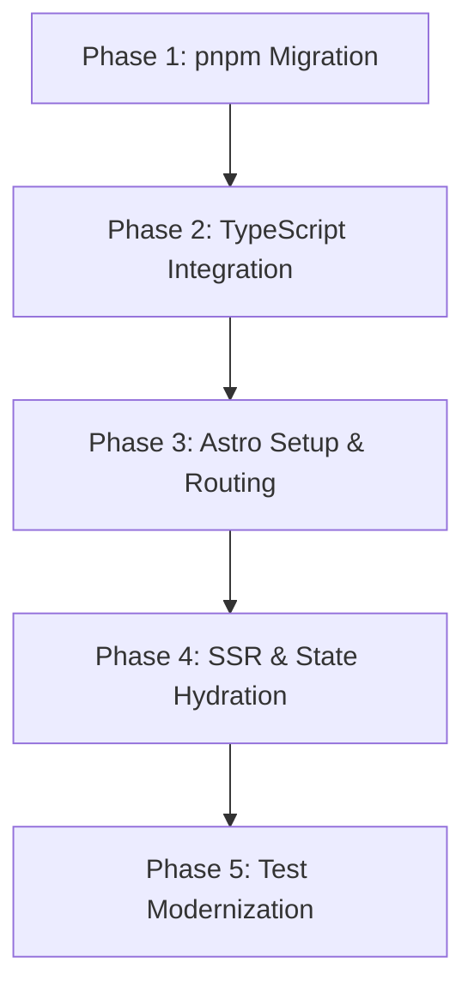

# PokeApp Frontend Migration Plan: React (CRA) to Astro SSR & pnpm

This document serves as the master migration plan to modernize the PokeApp frontend (`client`). It outlines the goals, architectural decisions, deployment strategies, and a step-by-step roadmap to transition the application from an outdated React 17 Create React App (CRA) build to a modern, lightweight, server-side rendered (SSR) architecture using **Astro** and **pnpm**.

---

## 1. Executive Summary: The Modernization Opportunity

The current PokeApp frontend is a React 17 application built with Create React App (CRA) using `npm`. A review reveals several opportunities for modernization:

| Feature / Tooling | Current State | Proposed State (Target) | Why it matters |
| :--- | :--- | :--- | :--- |
| **Package Manager** | `npm` (with `package-lock.json`) | `pnpm` (with `pnpm-lock.yaml`) | Align with the backend (`api`), achieve faster installs, and reduce disk space usage. |
| **Build System** | Create React App (Deprecated, Webpack 4) | **Astro v4+** (Vite-powered) | CRA is end-of-life and slow. Astro provides modern Vite speed and excellent SSR support. |
| **Rendering Strategy**| Client-Side Rendering (CSR / SPA) | **Server-Side Rendering (SSR)** | SSR improves SEO, accelerates Initial Page Load (FCP/LCP), and reduces client load. |
| **State Management** | Redux (Thunk, `connect` wrapper) | Server-Side Data Fetch + URL Search Parameters | Eliminates Redux boilerplate. Data is fetched on the server; UI filter states reside in the URL. |
| **Routing** | React Router v5 | Astro File-Based Routing | Eliminates client-side router overhead. Dynamic route configuration (`/pokemon/[id]`) is handled natively. |
| **Type Safety** | Vanilla JavaScript | TypeScript | Standardizes type safety, matching the backend codebase (`api`). |
| **Testing Framework**| Enzyme (React 16 adapter on React 17) | Vitest + React Testing Library (RTL) | Enzyme is deprecated and incompatible with modern React. Vitest matches the backend runner. |

---

## 2. Architecture & Data Flow

Astro utilizes **Island Architecture**. The layout, navbar, static pages, and detailed cards are rendered to pure HTML on the server. For interactive elements (such as the search bar input and the creation form), we mount React components as dynamic interactive islands that hydrate on the client.

### Request-Response Flow with Astro SSR

```mermaid
sequenceDiagram
    autonumber
    actor Browser as User Browser
    participant Astro as Astro SSR Server (client)
    participant API as Express API (api)
    database DB as PostgreSQL DB

    Browser->>Astro: Request Page (e.g., GET /pokemon/25)
    activate Astro
    Astro->>API: Server-Side Fetch (GET /pokemons/25)
    activate API
    API->>DB: Query Pokemon
    DB-->>API: Return DB Record
    API-->>Astro: Return Pokemon JSON
    deactivate API
    Astro->>Astro: Render HTML (Astro Layout + React Detail Component)
    Astro-->>Browser: Return Rendered HTML & minimal CSS
    deactivate Astro
    Note over Browser: Page renders instantly with ZERO client-side JavaScript!
```

---

## 3. Deployment & CI/CD Strategy

Since your frontend (`client`) and backend (`api`) are deployed separately, we have two paths for `pnpm` integration:

### Option A: Standalone pnpm Migration (Recommended for Zero Deployment Risk)
Maintain completely independent configurations.
- **Action**: Run `pnpm` exclusively inside the `client` directory. Do not define a root workspace.
- **Pipeline Impact**: The API deployment pipelines remain entirely unaffected. For the client deployment, change the build commands from `npm install` to `pnpm install` in your hosting provider (e.g., Netlify, Vercel, or AWS Amplify).

### Option B: Monorepo Setup (Unified pnpm Workspace)
Consolidate both projects under a single workspace.
- **Action**: Create a `pnpm-workspace.yaml` in the root workspace folder containing:
  ```yaml
  packages:
    - "api"
    - "client"
  ```
- **Pipeline Impact**: Deployment scripts must build from the workspace using filters:
  - Client Build: `pnpm --filter client build`
  - API Build: `pnpm --filter pokemon-api build`
  - In your deployment configuration, configure the root directory as the build root, and run `pnpm install` at the root.

---

## 4. Step-by-Step Migration Roadmap

The migration is divided into 5 chronological phases. Detailed instructions for each phase are linked below:



### Phase 1: Package Manager Migration
- Remove `node_modules` and `package-lock.json` in the `client` directory.
- Generate a new `pnpm-lock.yaml` via `pnpm install`.
- See the [pnpm Migration Guide](file:///Users/mstefanutti/workspace/PokeApp/client/docs/pnpm_migration.md) for full commands.

### Phase 2: TypeScript Integration
- Introduce TypeScript configuration (`tsconfig.json`) to the client directory.
- Define explicit interfaces for Pokemon model attributes (`id`, `name`, `life`, `strength`, `defense`, `speed`, `height`, `weight`, `img`, `types`).
- Standardize code file extensions to `.ts` / `.tsx`.

### Phase 3: Astro Project Configuration
- Install Astro and the `@astrojs/react` renderer wrapper to run React components inside Astro layouts.
- Retain existing CSS modules (which Astro supports natively).
- Map CRA public folder assets to Astro’s public directory.
- See the [SSR Astro Migration Guide](file:///Users/mstefanutti/workspace/PokeApp/client/docs/ssr_astro_migration.md) for structure details.

### Phase 4: SSR & State Hydration Migration
- **Routing**: Set up `/src/pages/` containing:
  - `index.astro` (Landing page)
  - `home.astro` (Lists all Pokemons, utilizing Server-Side fetching and query params)
  - `pokemon/[id].astro` (Details view, dynamic server rendering)
  - `create.astro` (Form to submit a new Pokemon)
- **State Redesign**: Replace client-side Redux store fetching with server-side fetches. Map filter inputs directly to browser URL Search Parameters (`?page=1&type=fire`).
- **Islands**: Hydrate components like `SearchBar` and `CreatePokemon` with the `client:load` modifier so users can interact with them.

### Phase 5: Test Modernization
- Remove the deprecated `enzyme` dependency.
- Setup Vitest with React Testing Library (RTL) to run test suites cleanly under modern React versions.
- Convert Enzyme tests into RTL user behavior simulations.

---

## 5. Detailed Guides

Please refer to the following companion documents to execute each step:
- [pnpm Migration Guide](file:///Users/mstefanutti/workspace/PokeApp/client/docs/pnpm_migration.md)
- [Astro SSR & React Island Migration Guide](file:///Users/mstefanutti/workspace/PokeApp/client/docs/ssr_astro_migration.md)
