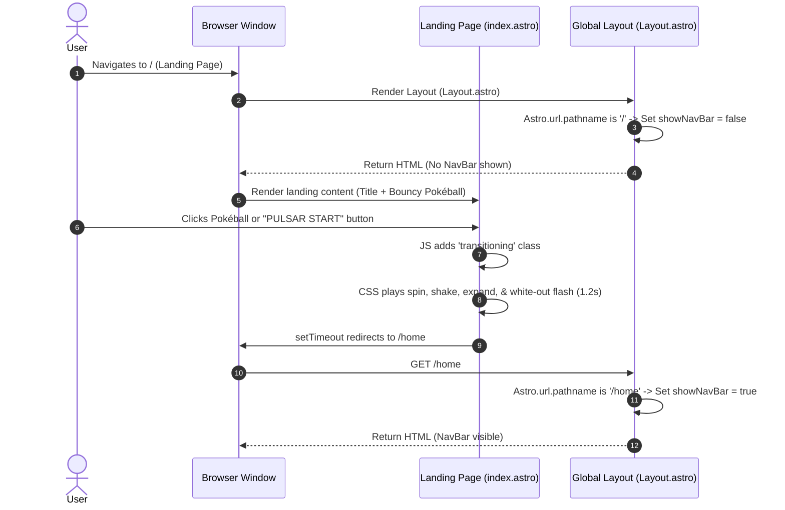
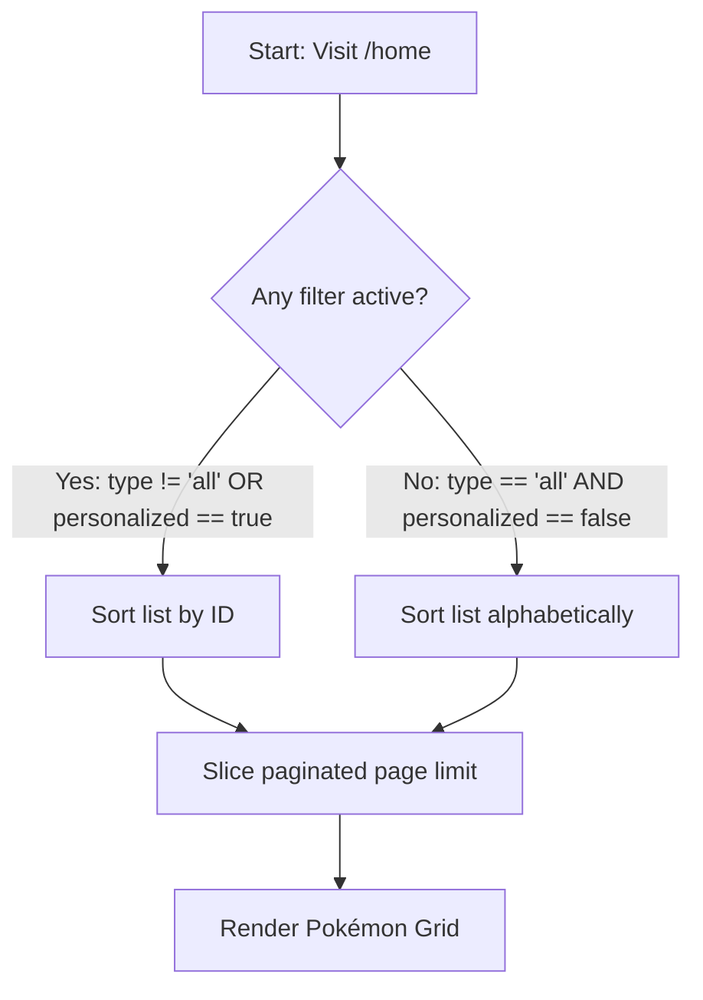
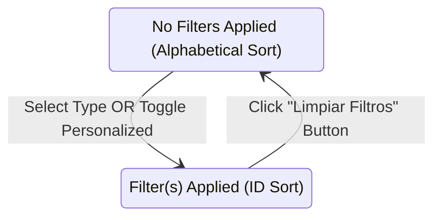

# Specification: Landing Page Refactor & Filter/Sort Corrections

This document details the specifications, design decisions, and step-by-step implementation plan for refining the PokeApp landing page (including hiding the navigation bar, adding a transition animation, and auto-routing to `/home`) and correcting the filtering/sorting logic on `/home`.

---

## 1. Landing Page Refactor (index.astro)

### 1.1 Visual & Structural Formatting
The current landing page has minimal formatting. The refactored version will align with the **Kanto Retro-Sleek Design System (v1.2.0)**:
- **Background**: Deep midnight blue to rich purple radial gradient (`radial-gradient(circle, #1e1b4b 0%, #090d16 100%)`) with faint floating star particles using CSS keyframe animations.
- **Card Container**: A glassmorphic tactile card in the center with a thick border (`--border-heavy`), soft corners, and a retro Game Boy/Switch hybrid styling.
- **Typography**: Playful typography using the system **Fredoka Rounded** font.
- **Centerpiece**: An interactive Pokéball image or icon that:
  - Floats up and down gently during idle states (hover/floating physics).
  - Shrinks and expands on mouse interaction (tactile feedback).
- **Control Button**: A prominent primary bouncy button labeled `"PULSAR START"` or `"¡Atrápalos ya!"` placed below the Pokéball.

### 1.2 Transition Animation & Redirection Flow
Rather than instantly navigating to `/home`, clicking the Pokéball or the start button triggers a transition animation:
1. When clicked, JavaScript attaches a `.transitioning` class to the page container.
2. The Pokéball begins spinning rapidly (`transform: rotate(1080deg)`) and shaking violently (simulating a capture sequence).
3. A white-out container fades in over the entire viewport, scaling the Pokéball up dynamically (`transform: scale(30)`).
4. After `1.2s` (matching the CSS transition time), JavaScript redirects the user to `/home` via `window.location.href`.



---

## 2. Conditional Navigation Bar Rendering (Layout.astro)
Since the landing page represents an immersive experience, the global navigation bar (`<NavBar />`) must be hidden on the landing page (`/`) but remain visible on all other pages (e.g., `/home`, `/create`, `/pokemon/:id`).

We will detect the current pathname server-side using `Astro.url.pathname` and conditionalize rendering:
```typescript
const showNavBar = Astro.url.pathname !== '/';
```

---

## 3. Pokémon List Sorting & Filtering Logic (home.astro & SearchBar.tsx)

### 3.1 Ordering Rules
- **No Filters Applied**: Pokémon must be sorted **alphabetically** (A-Z or Z-A based on the `sort` selector).
- **Any Filter Applied**: Pokémon must be sorted **by ID** (numerical order, ascending or descending based on `sort`).
  - *Active filters include*: Selecting a specific Type (`type !== 'all'`), or selecting Created Pokémon Only (`personalized = true`).



### 3.2 Clear Filters Option
To improve accessibility and usability, a new button labeled **"Limpiar Filtros" (Clear Filters)** will be introduced inside `SearchBar.tsx`:
- This button will only be rendered when `isFilterApplied` is true (i.e. `currentType !== 'all' || currentPersonalized`).
- Clicking it updates the URL search parameters, setting `type` to `'all'` and `personalized` to `false` (deleting these parameters from the URL).
- Once the parameters are cleared, the filters are deactivated and the sorting automatically reverts to alphabetical.



---

## 4. Implementation Steps

### Phase 1: Global Layout Navigation Adjustments
1. Open [Layout.astro](file:///Users/mstefanutti/workspace/PokeApp/client/src/layouts/Layout.astro).
2. Read the current request's URL path: `const showNavBar = Astro.url.pathname !== '/';`.
3. Wrap `<NavBar />` with a logical condition: `{showNavBar && <NavBar />}`.

### Phase 2: Landing Page Styling & Animation
1. Open [index.astro](file:///Users/mstefanutti/workspace/PokeApp/client/src/pages/index.astro).
2. Structure the page:
   - Root container with space particle backdrop.
   - Central card displaying the title "PokeApp" and the Pokéball.
   - Interactive Pokéball image wrapper targeting `/resources/pokeball.png`.
   - Bouncy "PULSAR START" button below the Pokéball.
   - A hidden overlay `div` that expands to white during the flash sequence.
3. Write scoped CSS styles:
   - Floating animation for the Pokéball (`@keyframes float`).
   - Spin-shake animation (`@keyframes spinShake`).
   - Expansive scale-up transition for the white-out transition.
4. Add client-side script in `index.astro` to hook the click event on the button/pokéball, add the `.transitioning` class, and run a `1.2s` timer to trigger `window.location.href = '/home';`.

### Phase 3: Add Clear Filters in SearchBar Component
1. Open [SearchBar.tsx](file:///Users/mstefanutti/workspace/PokeApp/client/src/components/SearchBar.tsx).
2. Determine if a filter is active: `const isFilterApplied = currentType !== 'all' || currentPersonalized;`.
3. Render a secondary or accent styled button for **"Limpiar Filtros"** if `isFilterApplied` is true.
4. On click, call `updateUrl({ type: 'all', personalized: false })`.
5. Open [SearchBar.module.css](file:///Users/mstefanutti/workspace/PokeApp/client/src/components/SearchBar.module.css) and style the new clear button to match the bouncy theme.

### Phase 4: Validate home.astro Sorting Integrity
1. Open [home.astro](file:///Users/mstefanutti/workspace/PokeApp/client/src/pages/home.astro) and verify that the sorting logic correctly sorts by ID when `isFilterActive` is true, and alphabetically when it is false.
2. Check that the numeric ID sorting handles both standard IDs and potential custom IDs safely by mapping `Number(id)` and treating them correctly.

### Phase 5: Verification & Tests
1. Start the application services using `make dev`.
2. Verify the landing page layout, animation, and automatic routing to `/home`.
3. Test that navigation bar does not show on the landing page, but displays properly on `/home`.
4. Apply a filter (e.g. type "fire") on `/home` and verify that the list is ordered by ID.
5. Click "Limpiar Filtros" and verify that the list reverts to alphabetical ordering.
6. Verify unit tests run successfully with `pnpm test`.
