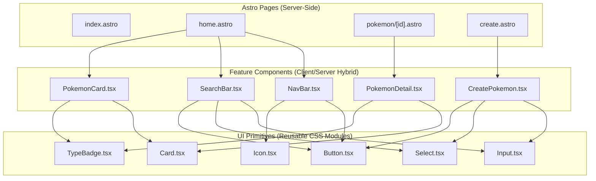

# Kanto Retro-Sleek Design System Integration Plan

This document outlines the migration plan to implement the **Kanto Retro-Sleek Design System (v1.2.0)** (see [styles_guide.md](file:///Users/mstefanutti/workspace/PokeApp/client/docs/styles_guide.md)) across the PokeApp frontend. 

It covers the transition from legacy CSS variables to the standardized design system, the directory structure for reusable UI primitives, integration with CSS Modules, and a step-by-step implementation roadmap.

---

## 1. Directory Structure & Organization

Following research and alignment, the reusable components for the design system will be structured as a **Flat Component Library** with a strict boundary between general UI primitives and feature-based components:

```
client/src/
├── components/
│   ├── ui/                    # Reusable Design System Primitives
│   │   ├── Button.tsx
│   │   ├── Button.module.css
│   │   ├── Card.tsx
│   │   ├── Card.module.css
│   │   ├── Input.tsx
│   │   ├── Input.module.css
│   │   ├── Select.tsx
│   │   ├── Select.module.css
│   │   ├── TypeBadge.tsx
│   │   ├── TypeBadge.module.css
│   │   ├── Icon.tsx
│   │   └── Icon.module.css
│   │
│   ├── features/              # Feature-Specific Layouts & Logic
│   │   ├── NavBar.tsx
│   │   ├── Navbar.module.css
│   │   ├── SearchBar.tsx
│   │   ├── SearchBar.module.css
│   │   ├── PokemonCard.tsx    # Formerly components/Pokemon.tsx
│   │   ├── Pokemon.module.css
│   │   ├── PokemonDetail.tsx
│   │   ├── PokemonDetail.module.css
│   │   ├── CreatePokemon.tsx
│   │   └── CreatePokemon.module.css
```

### 1.2 Component Dependency Graph



---

## 2. Refactoring to CSS Modules

To ensure high performance, isolation, and maintenance ease, all UI primitives will use **CSS Modules**. Global custom design variables (such as `--poke-red`, `--transition-bouncy`, etc.) will be declared inside [Layout.astro](file:///Users/mstefanutti/workspace/PokeApp/client/src/layouts/Layout.astro) and referenced directly in localized CSS modules.

### 2.1 Code Example: Button Primitive

**`Button.tsx`**
```tsx
import React from 'react';
import styles from './Button.module.css';

interface ButtonProps extends React.ButtonHTMLAttributes<HTMLButtonElement> {
  variant?: 'primary' | 'secondary' | 'accent';
  isBouncy?: boolean;
}

export default function Button({
  children,
  variant = 'primary',
  isBouncy = true,
  className = '',
  ...props
}: ButtonProps) {
  const buttonClass = [
    isBouncy ? styles.btnBouncy : '',
    styles[variant],
    className
  ].filter(Boolean).join(' ');

  return (
    <button className={buttonClass} {...props}>
      {children}
    </button>
  );
}
```

**`Button.module.css`**
```css
.btnBouncy {
  font-family: 'Fredoka', sans-serif;
  font-weight: 700;
  display: inline-flex;
  align-items: center;
  justify-content: center;
  gap: 0.5rem;
  border: none;
  cursor: pointer;
  border-radius: 1rem;
  transition: var(--transition-bouncy);
  user-select: none;
  text-decoration: none;
}

.btnBouncy:active {
  transform: scale(0.92);
}

.primary {
  background-color: var(--poke-red);
  color: var(--text-inverse);
  padding: 0.875rem 1.5rem;
  border-bottom: 4px solid #b91c1c;
  box-shadow: 0 4px 14px rgba(239, 68, 68, 0.2);
}

.primary:active {
  border-bottom-width: 0px;
  margin-top: 4px;
}

.secondary {
  background-color: var(--surface-card);
  color: var(--poke-blue);
  border: 2px solid var(--poke-blue);
  border-bottom: 4px solid var(--poke-blue);
  padding: 0.75rem 1.5rem;
}

.secondary:active {
  border-bottom-width: 2px;
  margin-top: 2px;
}

.accent {
  background-color: var(--poke-yellow);
  color: #0f172a;
  border-bottom: 4px solid #d97706;
  padding: 0.875rem 1.5rem;
}

.accent:active {
  border-bottom-width: 0px;
  margin-top: 4px;
}
```

---

## 3. Step-by-Step Implementation Roadmap

The implementation is broken down into 4 consecutive phases.

### Phase 1: Global Theme Config & Typography Integration
*   Modify [Layout.astro](file:///Users/mstefanutti/workspace/PokeApp/client/src/layouts/Layout.astro):
    *   Add the Google Fonts stylesheet link inside `<head>` to import *Fredoka Rounded* font weights `300..700`.
    *   Inject design tokens (`:root` and `html.dark` configurations) inside `<style is:global>`.
    *   Set up baseline overrides for `body`, `h1` through `h6`, and standard `a` link styles.

### Phase 2: Implement UI Primitives (`src/components/ui/`)
*   Create the core UI primitive components utilizing CSS modules:
    *   `Button.tsx` (Supports Primary, Secondary, and Accent states with bouncy animation physics).
    *   `Card.tsx` (Supports standard, interactive-hover, and dark elevation structures).
    *   `Input.tsx` & `Select.tsx` (Styled with rounded geometry and heavy borders).
    *   `TypeBadge.tsx` (Dynamically accepts a Pokémon type name, pulls its respective color/background alpha token, and maps the matching inline vector SVG emblem from Section 7 of the style guide).
    *   `Icon.tsx` (Standard container mapping utility icons: Hamburger menu, back/forward arrows, backpack, and arena).

### Phase 3: Migrate Feature Components (`src/components/features/`)
*   Refactor the active PokeApp features:
    *   **NavBar**: Replace legacy icons with the standard SVG icons. Replace navigation buttons with bouncy text links.
    *   **PokemonCard** (formerly `Pokemon.tsx`): Implement the `.card` structure, apply the standard `# ID` layout, and utilize the new `TypeBadge` primitives.
    *   **SearchBar**: Refactor inputs and selector dropdowns to use `Input` and `Select` primitives. Map filter controls to bouncy toggles.
    *   **PokemonDetail**: Replace hardcoded layout divs with a high-contrast `Card` grid, inject type emblem assets, and format stats into a responsive detail block.
    *   **CreatePokemon**: Refactor form fields, numeric counters, multiple-selection fields, and submit triggers to utilize the primary bouncy buttons.

### Phase 4: CSS Cleanup & Visual Verification
*   Audit all feature stylesheets (e.g. `CreatePokemon.module.css`, `Navbar.module.css`) to remove legacy properties (like `--seccolor`, `--thirdcolor`, `--bdrcolor`).
*   Confirm typography rendering scales smoothly down to mobile sizes.
*   Validate contrast behavior in both Light Mode (`:root`) and Dark Mode (`html.dark`) states.
